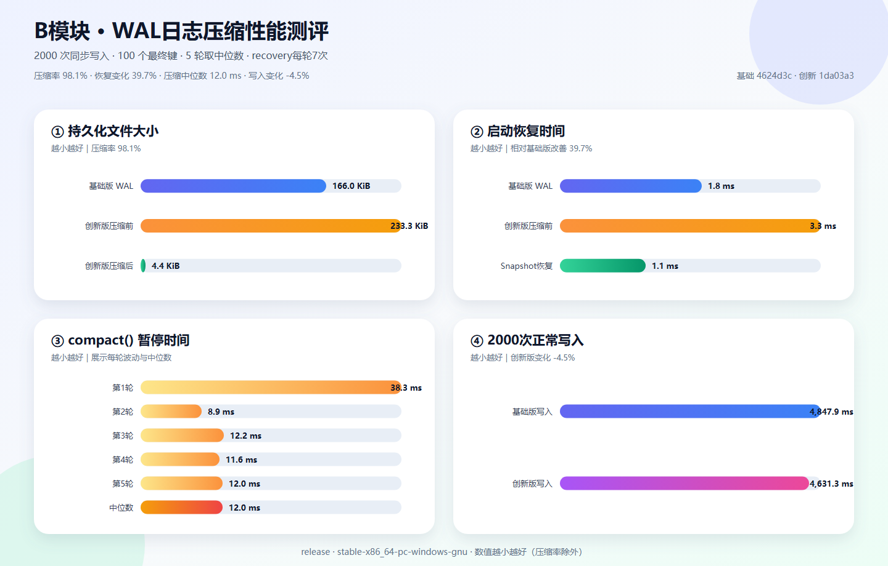

# B模块WAL日志压缩测评结果

## 测试输入

| 参数 | 数值 |
| --- | ---: |
| 同步SET次数 | 2000 |
| 最终有效键 | 100 |
| 完整运行轮次 | 5 |
| 每轮恢复重复 | 7 |
| 编译模式 | release |
| 工具链 | stable-x86_64-pc-windows-gnu |

写入采用固定的循环覆盖负载：`key:0000`到`key:0099`，值为递增的`value:XXXXXXXX`。每轮使用新的临时目录，写入后和每次恢复后都验证全部最终键值。

## 四项实验中位数

| 指标 | 基础版 | 创新版压缩前 | 创新版压缩后 |
| --- | ---: | ---: | ---: |
| 持久化文件大小 | 166.0 KiB | 233.3 KiB | 4.4 KiB |
| 启动恢复 | 1.8 ms | 3.3 ms | 1.1 ms |
| `compact()`暂停 | — | — | 12.0 ms |
| 2000 次正常写入 | 4,847.9 ms | 4,631.3 ms | 与压缩前相同 |

## 结论

- 创新版自身压缩前后空间减少 **98.1%**。
- 创新版压缩后相对基础版空间减少 **97.4%**。
- Snapshot恢复相对基础版变化 **39.7%**；相对创新版压缩前变化 **67.2%**。
- 单次`compact()`暂停中位数为 **12.0 ms**。
- 创新版正常写入相对基础版变化 **-4.5%**。数值接近0时应解释为没有观察到明显退化，正负波动不代表写入优化。
- 新版WAL元数据使压缩前文件相对基础版变化 **40.5%**。

原始数据见`b_compaction_metrics.json`和`b_compaction_samples.csv`。耗时受磁盘缓存和系统负载影响，文件大小及最终数据校验是确定结果。